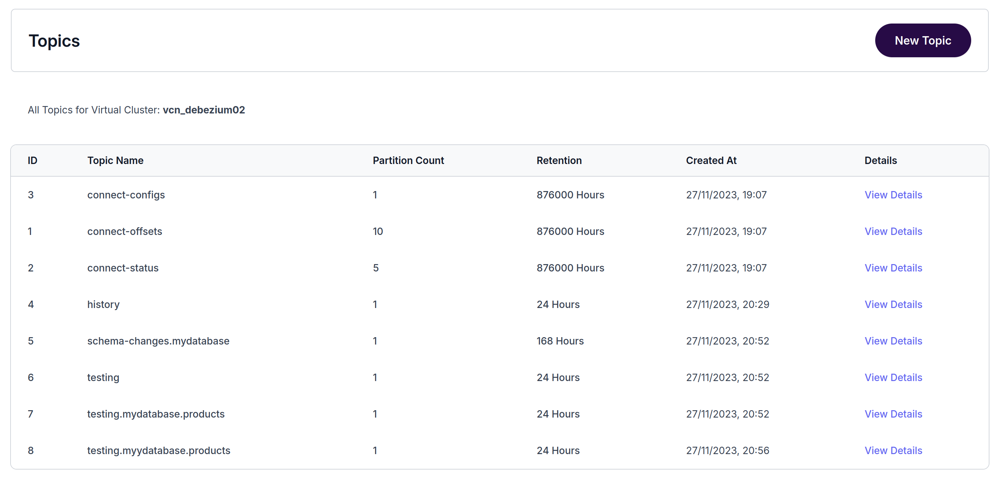

# CDC using Debezium and WarpStream

Trying out WarpStream as a Kafka alternative with Debezium. Read more about WarpStream from [Kafka is dead, long live Kafka](https://www.warpstream.com/blog/kafka-is-dead-long-live-kafka)



Install the Warpstream agent locally using

```
curl https://console.warpstream.com/install.sh | bash
```

Log in to the Warpstream console to get your pool name, Cluster ID and API key at [https://console.warpstream.com](https://console.warpstream.com)

Start the agent locally using the following command with an s3 bucket and WarpStream details added:

```
warpstream agent -agentPoolName apn_xxxxx -bucketURL s3://my-test-bucket/folder1 -apiKey aks_xxxx -defaultVirtualClusterID vci_xxxx
```

Use Docker Compose to start Mariadb and Debezium containers to try to out CDC.

The database will be preloaded with a products table with some sample products.

A Debezium connector will snapshot the data and capture ongoing changes and send the data to WarpStream.

```docker-compose.yml
version: '3.1'
services:
  mariadb:
    image: mariadb:latest
    environment:
      MYSQL_ROOT_PASSWORD: root_password
      MYSQL_DATABASE: test_db
    ports:
      - "3306:3306"

  debezium:
    image: debezium/connect:latest
    depends_on:
      - mariadb
    environment:
          BOOTSTRAP_SERVERS: api-xxxxxxxxxx.discovery.prod-z.us-east-1.warpstream.com:9092
          CONFIG_STORAGE_TOPIC: debezium_connect_config
          OFFSET_STORAGE_TOPIC: debezium_connect_offsets
    volumes:
      - ./debezium/connector.json/:/kafka/connector.json
```

Create an initial Connector JSON file for Debezium using the following JSON:

```
{
    "connector.class": "io.debezium.connector.mysql.MySqlConnector",
    "database.history.kafka.bootstrap.servers": "api-xxxxxxxxxxxx.discovery.prod-z.us-east-1.warpstream.com:9092",
    "database.history.kafka.topic": "history",
    "database.hostname": "mariadb",
    "database.password": "rootpassword",
    "database.port": "3306",
    "database.server.id": "123",
    "database.server.name": "mydatabase",
    "database.user": "root",
    "database.whitelist": "mydatabase",
    "schema.history.internal.kafka.bootstrap.servers": "api-xxxxxxxxxxxxx.discovery.prod-z.us-east-1.warpstream.com:9092",
    "schema.history.internal.kafka.topic": "schema-changes.mydatabase",
    "table.whitelist": "mydatabase.products",
    "tasks.max": "1",
    "topic.prefix": "testing",
    "transforms.unwrap.type": "io.debezium.transforms.ExtractNewRecordState",
    "transforms": "unwrap"
}
```

Run `docker-compose up -d` and connect to the Debezium container:

```
docker exec -it debezium /bin/bash
```

Create a Connector in Debezium:

```
curl -X PUT http://localhost:8083/connectors/my_database/config -H "Content-Type: application/json" -d @connector.json
```

List Connectors:

```
curl localhost:8083/connectors
```

Check Connector status:

```
curl localhost:8083/connectors/my_database/status
```

Use the Kafka CLI to list topics in WarpStream

```
./bin/kafka-topics.sh --bootstrap-server localhost:9092 --list
```

List the messages in a topic

```
./bin/kafka-console-consumer.sh --bootstrap-server localhost:9092 --topic testing.mydatabase.products --from-beginning
```

Add some more records to the table in the database and watch the records show up in the topic:

```

INSERT INTO products (name, price) VALUES
    ('Organic Almond Butter', 10.99),
    ('Whole Grain Bread', 3.49),
    ('Cold Pressed Olive Oil', 15.99),
    ('Gluten Free Pasta', 2.99),
    ('Organic Coconut Milk', 2.49),
    ('Free Range Eggs', 4.99),
    ('Grass Fed Beef', 8.99);
```

Check your s3 bucket and you'll be able to see your data in a custom WarpStream format, in a folder for each Virtual cluster:

```
aws s3 ls s3://my-test-bucket/
```

```
warpstream/
  vci_108c3ae4_0896_4d96_8f02_e5c8ea2c69c8/
```