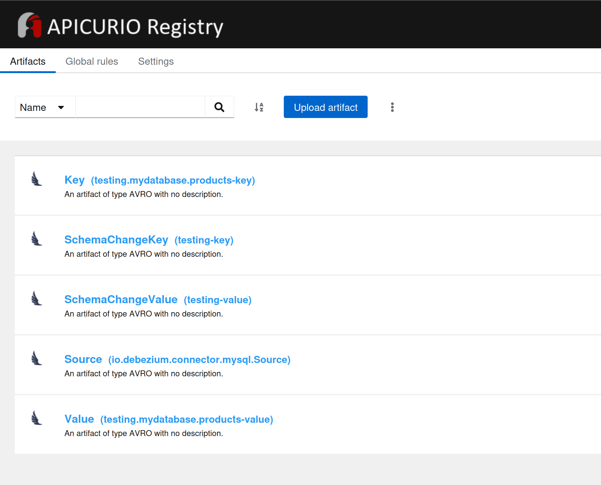

# CDC using Debezium and WarpStream - with Avro serialization and Apicurio Schema Registry

## What is Avro serialization?

Apache Avro is a compact, efficient binary format that provides rich data structures and a fast, binary data serialization and deserialization framework. [[Read more](https://avro.apache.org/)]

## What is an Apicurio Schema Registry?

Apicurio schema registry stores Avro schemas and provides a central repository for version-controlled schemas, enhancing data governance. [[Read more](https://www.apicur.io/registry/)]

## Why use Avro and Apicurio schema registry?

Avro serializtion compacts the data for effective transfer and storage. Apicurio stores the schemas so the data can be serialized and deserialized  correctly.

Debezium captures database changes (inserts, updates, deletes) and publishes them to Kafka topics in Avro format. Apicurio Schema Registry stores the Avro schemas used by Debezium, allowing consumers to understand the data structure. Kafka consumers like Apache Flink retrieve the data and the schema from the schema registry, ensuring that the data is serialized correctly.

## Usage

Install the Warpstream agent locally using

```
curl https://console.warpstream.com/install.sh | bash
```

Log in to the Warpstream console to get your pool name, Cluster ID and API key at [https://console.warpstream.com](https://console.warpstream.com)

Start the agent locally using the following command with an s3 bucket and WarpStream details added:

```
warpstream agent -agentPoolName apn_xxxxx -bucketURL s3://my-test-bucket/folder1 -apiKey aks_xxxx -defaultVirtualClusterID vci_xxxx
```

Use Docker Compose to start Mariadb, Debezium and Apicurio containers to try to out CDC. The database will be preloaded with a products table with some sample products.

A Debezium connector will snapshot the data and capture ongoing changes and send the data to WarpStream. The schemas of the tables will be stored in Apicurio.

First, update the docker-compose.yml file and the files/connector.json with the cluster address provided by WarpStream.

The connector contains a number of `key.converter.apicurio.*` and `value.converter.apicurio.*` to instruct Debezium to serialize the data.

Start the containers:

```
docker-compose up -d
```

Connect to the Debezium container:


```
docker exec -it debezium /bin/bash
```

Create a Connector in Debezium:

```
curl -X PUT http://localhost:8083/connectors/my_database/config -H "Content-Type: application/json" -d @connector.json
```

List Connectors:

```
curl localhost:8083/connectors
```

Check Connector status:

```
curl localhost:8083/connectors/my_database/status
```


The UI for Apicurio will be available at http://localhost:8081

(Using port 8081 here as port 8080 is taken up by the WarpStream agent)

You'll see some schemas created in the UI, such as `testing.mydatabase.products-value`

