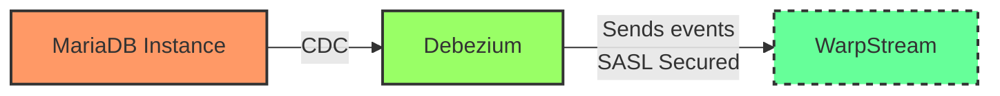

# CDC from MariaDB using Debezium and WarpStream

Trying out WarpStream as a Kafka alternative with Debezium.

This repo contains a plain text connection example in `/insecure` and a SASL connection example in `/sasl`

In both folders, an example docker-compose.yml file is provided that launches a mariadb and a debezium container

A connector is then submitted to Debezium which will tell it to read from Mariadb and push events to WarpStream.

